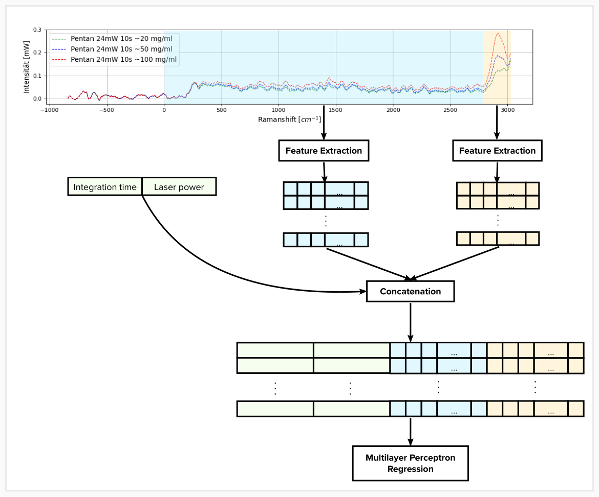

# Intelligent Spectral Analysis

# Abstract
This project proposes an ML-based approach to determine the concentration of Pentanediol dissolved in water. Raman spectroscopy will be used to record light spectra for different concentrations under different settings. The aim is to create a dataset of spectra that are mapped to known concentration. In order to learn this mapping, a machine learning based approach is developed.  

This approach is subdivided into two parts: preprocessing and training. Preprocessing includes trimming and smoothing the spectra, extracting features before conducting a selection of the best features. The training stage involves training and comparing the performance of different regression models using Cross-Validation in order to select a promising model, before fine-tuning it with Grid Search. Finally, an evaluation is conducted, from which conclusions and improvement suggestions are drawn.  

# How to reproduce results?

## Data
1. Download the raw data 'pentanediol.txt' from Google Drive using the following [URL](https://drive.google.com/file/d/16NH1MDH6PU-ZU7xEN8VZw7G6KYfUE8gg/view?usp=sharing).  
2. Move the file 'pentanediol.txt' into the directory `data/raw`.  

## Libraries
Install the following libraries:

- [numpy](https://numpy.org/install/)  
- [pandas](https://pandas.pydata.org/docs/getting_started/install.html)  
- [matplotlib](https://matplotlib.org/stable/users/installing/index.html)  
- [scikit-learn](https://scikit-learn.org/stable/install.html)  
- [TSFEL](https://tsfel.readthedocs.io/en/latest/)  

